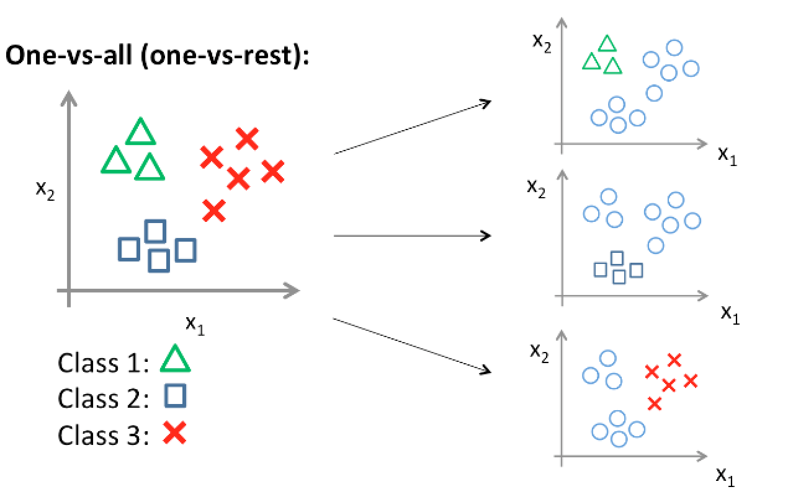

This Repo contains the solutions for the second Problem Set, where we discussed Softmax Classifier used for multi-class classification (as opposed to only binary classification).

Image taken from [https://houxianxu.github.io/2015/04/23/logistic-softmax-regression/](https://houxianxu.github.io/2015/04/23/logistic-softmax-regression/)

For the programming part of the assignment, we used the Fashion-MNIST dataset from [Kaggle](https://www.kaggle.com/zalando-research/fashionmnist).
