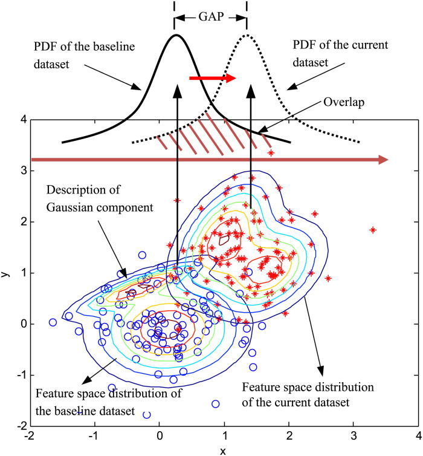

This Repo contains the solutions for the fourth Problem Set, where we discussed Gaussian Mixture models.

Image taken from [http://manufacturingscience.asmedigitalcollection.asme.org/article.aspx?articleid=1461059](http://manufacturingscience.asmedigitalcollection.asme.org/article.aspx?articleid=1461059)

For the programming part of the assignment, we used the Fashion-MNIST dataset from [Kaggle](https://www.kaggle.com/zalando-research/fashionmnist).